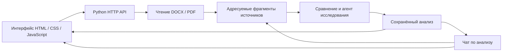

# TeleDoc — анализ организационных изменений

TeleDoc сравнивает документы до и после реорганизации: показывает изменения подразделений, возможную потерю и дублирование функций, пересечения ответственности. Каждый вывод можно проверить по исходному пункту документа, обсудить с агентом и включить в заключение после оценки сотрудником.

## Как работать

1. Загрузите комплекты «До» и «После» или используйте восемь учебных DOCX для проверки.
2. Запустите анализ. Откройте найденные изменения и сравните цитаты из источников.
3. Подтвердите или отклоните замечания, сохраните комментарии аналитика.
4. Задайте вопрос под результатами. Агент использует сохранённый анализ, ищет исходные фрагменты и возвращает ответ с цитатами.
5. Скачайте заключение в Markdown.

Без API-ключа доступно сравнение DOCX по текстовым правилам. Настроенная модель добавляет смысловой анализ и чат. Экран показывает фактический режим обработки и ограничения результата. «Посмотреть пример» открывает отдельное учебное дело C010.

## Что установить

- [Python 3.10 или новее](https://www.python.org/downloads/) с `pip` и `venv`. На Windows включите добавление Python в PATH.
- [Git](https://git-scm.com/downloads).

Node.js и Docker для запуска приложения не нужны.

```sh
git clone --branch codex/fullstack-integration https://github.com/BAITC-Hacks/hack-4411138e-freax.git
cd hack-4411138e-freax
```

## Настройка и запуск

Скопируйте `.env.example` в `.env`, если файл ещё не создан. Укажите свой ключ и доступную вашему аккаунту модель:

```dotenv
OPENAI_API_KEY=ваш_ключ
OPENAI_BASE_URL=https://api.openai.com/v1
OPENAI_MODEL=gpt-5.4
```

`.env` хранится только локально и исключён из Git. После его изменения перезапустите сервер.

На Windows:

```powershell
powershell -NoProfile -ExecutionPolicy Bypass -File .\run.ps1
```

На Linux или macOS:

```sh
bash run.sh
```

Скрипты читают `.env`, создают `.venv`, устанавливают зависимости из `requirements.txt` и запускают приложение. При повторном запуске готовое окружение используется снова. Другой порт: `.\run.ps1 --port 9000` или `bash run.sh --port 9000`.

Откройте [TeleDoc](http://127.0.0.1:8765/). Оставьте терминал открытым; остановка — `Ctrl+C`. [Проверка сервера](http://127.0.0.1:8765/api/health) возвращает `status: ok` и `frontend: true`.

## Ручной запуск

Для запуска без скриптов создайте окружение и установите зависимости:

```powershell
# Windows
python -m venv .venv
.\.venv\Scripts\python.exe -m pip install -r requirements.txt
$env:OPENAI_API_KEY = 'ваш_ключ'
$env:OPENAI_BASE_URL = 'https://api.openai.com/v1'
$env:OPENAI_MODEL = 'gpt-5.4'
.\.venv\Scripts\python.exe server.py --port 8765
```

```sh
# Linux / macOS
python3 -m venv .venv
.venv/bin/python -m pip install -r requirements.txt
export OPENAI_API_KEY='ваш_ключ'
export OPENAI_BASE_URL='https://api.openai.com/v1'
export OPENAI_MODEL='gpt-5.4'
.venv/bin/python server.py --port 8765
```

При ручном запуске `server.py` настройки берутся из переменных окружения. Для загрузки настроек из `.env` используйте `run.ps1` или `run.sh`.

## Архитектура



Один Python-сервер раздаёт интерфейс и API. Для PDF используется `pypdf`. Модель подключается через OpenAI-совместимый API; исследование с поиском по смыслу также использует эмбеддинги. Сервер проверяет адрес источника и точность цитаты. Оценки аналитика и оригиналы хранятся в браузере, снимки анализа и история чата — локально на сервере. Текст для смысловой обработки передаётся настроенному провайдеру.

Основные модули: `ayqyn/documents/` — чтение документов, `ayqyn/retrieval/` — поиск, `ayqyn/agent/` — исследование, `ayqyn/chat/` — чат, `ayqyn/api/` — HTTP API. Интерфейс находится в `analysis.js`, `workspace.js` и `live-chat.js`.

## Форматы и ограничения

- Обычный анализ: 2–20 DOCX, до 100 МБ на файл и 200 МБ суммарно. Извлечённый XML ограничен 12 МиБ; анализ — 1500 абзацами и 250 000 символами на сторону.
- Исследование с поиском источников: DOCX и текстовый PDF, до 10 МБ на файл и 40 МБ суммарно. PDF — до 200 страниц. Для PDF укажите стороны вручную.
- OCR сканов, Excel и старый формат `.doc` не подключены. Колонтитулы и комментарии Word не анализируются.
- Выводы требуют проверки сотрудником. Точная цитата подтверждает источник, но сама по себе не доказывает правильность интерпретации. Неполный анализ обозначается явно.
- Сервер рассчитан на локальную работу одного пользователя. Локальные оценки аналитика не передаются агенту автоматически.

## Проверки и API

```sh
python -m unittest discover -s tests -q
```

[Контракт чата](docs/api/analysis-chat-api.md) · [Устройство интеграции](docs/INTEGRATION.md) · [Результаты проверок](REVIEW_HANDOFF.md).
