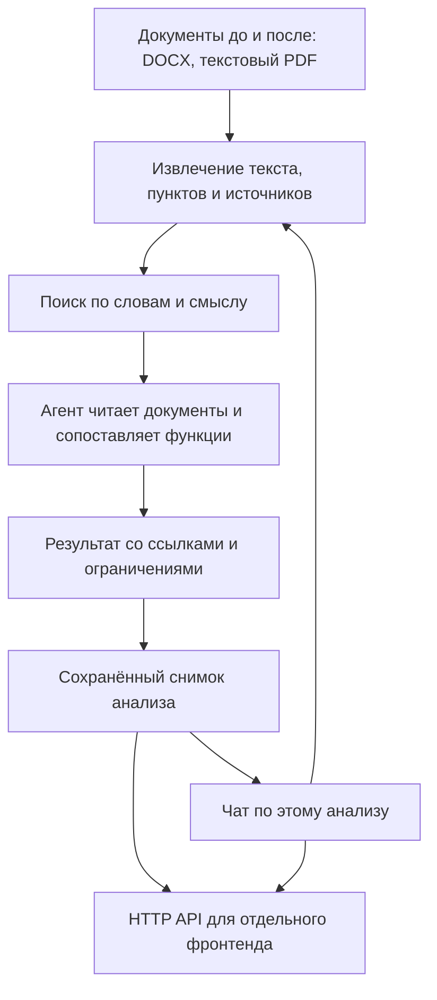

# AYQYN — анализ организационных изменений

AYQYN помогает сотруднику сравнить документы **до и после реорганизации**: найти изменения подразделений, возможную потерю или дублирование функций и пересечение ответственности. Каждый существенный вывод должен вести к исходному пункту документа. После анализа можно задавать вопросы чат-агенту: он перечитывает источники и объясняет результат.

Это прототип для хакатона. **Ветка `codex/backend-research-snapshot` содержит бэкенд и агентов.** Интерфейс и общая интеграция фронтенда, бэкенда и ML ведутся отдельно. При запуске этой ветки браузер показывает данные JSON, а не готовую страницу загрузки документов. Выводы требуют проверки сотрудником.

## Как устроено решение



Модель выбирает инструменты поиска и чтения. Сервер проверяет адреса источников, точность цитат и то, что агент прочитал соответствующий фрагмент. Чат сохраняет отдельную историю и не переписывает исходный отчёт. Эти проверки подтверждают происхождение цитаты, но не заменяют проверку смысла человеком.

Основа — Python, стандартная библиотека и `pypdf` из [requirements.txt](requirements.txt). Поиск и данные хранятся локально; отдельная база данных, Node.js и Docker для запуска этого бэкенда не нужны. Используются существующие модули проекта, новые зависимости для чата не добавлены.

## Что скачать

1. [Python 3.10 или новее](https://www.python.org/downloads/) с `pip` и `venv`. Если подходящий Python уже установлен, используйте его. На Windows при установке включите добавление Python в PATH; на Linux может понадобиться системный пакет `python3-venv`.
2. [Git](https://git-scm.com/downloads), если его ещё нет.
3. Репозиторий. Откройте терминал в папке, где хотите хранить проект:

```sh
git clone --branch codex/backend-research-snapshot https://github.com/BAITC-Hacks/hack-4411138e-freax.git
cd hack-4411138e-freax
```

Все следующие команды выполняются **из этой папки**. Если репозиторий уже скачан, второй экземпляр не нужен. Интернет требуется при первой установке зависимостей и для работы с удалённой моделью.

## Настройки модели: файл `.env`

Создайте свою копию [.env.example](.env.example):

```powershell
# Windows, PowerShell
Copy-Item .env.example .env
```

```sh
# Linux / macOS
cp .env.example .env
```

Откройте `.env` в текстовом редакторе. Основные настройки:

```dotenv
OPENAI_API_KEY=ваш_ключ
OPENAI_BASE_URL=https://api.openai.com/v1
OPENAI_MODEL=gpt-5.4
```

Используйте модель, доступную вашему аккаунту и поддерживающую вызов инструментов. Для поиска нужен также endpoint эмбеддингов; по умолчанию используется `text-embedding-3-small`. Совместимость произвольных сторонних провайдеров не подтверждена. Значения в примере описывают существующую настройку проекта, а не гарантию качества модели.

**Без ключа тоже можно запустить сервер**, читать документы, получать сохранённые результаты и выполнять тесты. Оставьте `OPENAI_API_KEY` пустым. Для живого анализа агентом и чата нужны рабочие настройки провайдера. Документы передаются ему при запросах модели и эмбеддингов; такие запросы могут быть платными. Ключ храните только локально: `.env` исключён из Git.

## Запуск готовыми скриптами

После создания `.env` выполните команду для своей системы:

```powershell
# Windows, PowerShell
.\run.ps1
```

```sh
# Linux / macOS
bash run.sh
```

[run.ps1](run.ps1) и [run.sh](run.sh) находят установленный Python, создают `.venv` при необходимости и устанавливают отсутствующие зависимости из `requirements.txt`. Они загружают `.env` и запускают сервер. Настройки из `.env` имеют приоритет над одноимёнными переменными окружения для этого запуска. Скрипты не устанавливают Python глобально.

Другой порт: `.\run.ps1 --port 9000` или `bash run.sh --port 9000`. При необходимости можно указать путь к уже установленному интерпретатору через переменную `AYQYN_PYTHON`.

Откройте [проверку сервера](http://127.0.0.1:8765/api/health). Ожидаемый ответ:

```json
{"service":"AYQYN","status":"ok","frontend":false}
```

Оставьте терминал открытым; остановка — `Ctrl+C`. Сервер доступен только на вашем компьютере, по адресу `127.0.0.1`.

## Ручной запуск

Этот способ полезен, если хотите управлять окружением самостоятельно. Если `.venv` уже создана, повторять команду её создания не нужно. `server.py` и исследовательский CLI сами не читают `.env`, поэтому в командах ниже настройки задаются в терминале. Для запуска без модели оставьте ключ пустым.

**Windows, PowerShell:**

```powershell
python -m venv .venv
.\.venv\Scripts\python.exe -m pip install -r requirements.txt
$env:OPENAI_API_KEY = 'ваш_ключ'
$env:OPENAI_BASE_URL = 'https://api.openai.com/v1'
$env:OPENAI_MODEL = 'gpt-5.4'
.\.venv\Scripts\python.exe server.py --port 8765
```

**Linux / macOS:**

```sh
python3 -m venv .venv
.venv/bin/python -m pip install -r requirements.txt
export OPENAI_API_KEY='ваш_ключ'
export OPENAI_BASE_URL='https://api.openai.com/v1'
export OPENAI_MODEL='gpt-5.4'
.venv/bin/python server.py --port 8765
```

После изменения настроек перезапустите сервер. Если PowerShell блокирует выполнение `.ps1`, используйте `powershell -NoProfile -ExecutionPolicy Bypass -File .\run.ps1`: разрешение действует только для этого запуска. Ручной способ выше также работает.

## Как проверить основной сценарий

**Без модели:** запустите HTTP-тесты из раздела «Проверки». Они создают документы, выполняют настоящий анализ через сервер, отправляют вопрос в чат и проверяют цитату. Ответы модели в тестах заданы заранее; API-ключ и расходы не нужны.

**С моделью:** задайте переменные окружения по инструкции ручного запуска и выполните исследование учебного комплекта C010:

```powershell
# Windows
.\.venv\Scripts\python.exe scripts/run_research.py --case C010 --reasoning-effort none --max-calls 24 --max-seconds 240
```

```sh
# Linux / macOS
.venv/bin/python scripts/run_research.py --case C010 --reasoning-effort none --max-calls 24 --max-seconds 240
```

Команда выведет путь `output/research/r-...`, статус и число находок. Для своих файлов замените `--case C010` на `--before "до.docx" --after "после.pdf"`. В каждой стороне можно передать несколько файлов. Доступные параметры: `scripts/run_research.py --help`.

При работающем сервере откройте `http://127.0.0.1:8765/api/research/r-ВАШ_ID?view=workspace`, подставив полученный ID целиком. Этот GET только читает результат. Для завершённого исследования ответ также содержит `analysis_id` для чата. Статус частичного или ошибочного выполнения нужно учитывать, а не считать анализ завершённым по наличию файла.

`--prepare-only` всё равно может обращаться к API эмбеддингов. `--resume` продолжает незавершённую работу и может расходовать токены; для простого просмотра используйте GET.

## API и передача фронтенду

Все POST-запросы принимают JSON с `Content-Type: application/json`. Файл передаётся как объект `{"name":"документ.docx","data":"содержимое файла в base64"}`; путь к файлу на компьютере пользователя сервер не читает.

| Действие | Запрос |
|---|---|
| Прочитать DOCX/PDF без модели | `POST /api/packet/read` с `documents` и `mode: "auto"` |
| Подготовить агентное исследование и индекс | `POST /api/research/prepare` с `documents`, `mode` и при необходимости `config` |
| Запустить подготовленное исследование | `POST /api/research/run` с `id: "r-..."` и при необходимости `config` |
| Получить отчёт для интерфейса | `GET /api/research/{id}?view=workspace` |
| Выполнить прежнюю сверку DOCX | `POST /api/analyze` с `before`, `after`, `useAI: false` для правил или `true` для модели |
| Получить снимок анализа | `GET /api/analyses/{analysis_id}` |
| Получить историю чата | `GET /api/analyses/{analysis_id}/chat` |
| Задать вопрос | `POST /api/analyses/{analysis_id}/chat/messages` |
| Проверить готовность ответа | `GET /api/analyses/{analysis_id}/chat/turns/{turn_id}` |
| Открыть подтверждающий источник | `GET /api/analyses/{analysis_id}/source?fragment_id=...` |

Пример тела первого сообщения при пустой истории и настроенной на сервере модели:

```json
{
  "client_message_id": "question-001",
  "expected_version": 0,
  "text": "На какие пункты опирается вывод о потере функции?"
}
```

Сервер отвечает HTTP 202 и `turn_id`. Фронтенд опрашивает статус каждые 1–2 секунды до завершения и показывает ответ либо ошибку. Для следующих вопросов нужны актуальная `conversation_version` из истории и новый `client_message_id`. Повтор того же запроса с тем же ID безопасен и не запускает второй ответ.

Фронтендеру переданы [контракт чата с примерами и ошибками](docs/api/analysis-chat-api.md) и [план со статусом реализации](docs/plans/analysis-chat-backend.md). Он реализует загрузку, отчёт, чат под анализом, открытие цитат и отображение ограничений. Произвольный браузерный origin сервер не разрешает: интеграции нужен единый origin или корректно настроенный локальный proxy. Сервер пока не сохраняет ручные оценки аналитика и не формирует пользовательский экспорт.

## Где находятся код и результаты

| Папка | Назначение |
|---|---|
| `ayqyn/documents/` | Извлечение текста и адресуемые источники |
| `ayqyn/retrieval/` | Поиск по словам и эмбеддингам, кеш индекса |
| `ayqyn/agent/` | Агент исследования документов |
| `ayqyn/chat/` | Снимки, история и агент вопросов по анализу |
| `ayqyn/api/`, `ayqyn/providers/` | HTTP API и подключение модели |
| `scripts/`, `tests/` | Запуск исследований и автоматические проверки |
| `sources/`, `osnovanie_dataset_v1/` | Документы и учебные комплекты |
| `output/research/` | Исследования, оригиналы, индекс и журнал |
| `output/analyses/` | Снимки анализов, история чата и журналы ответов |

`output/` создаётся локально и не входит в Git. Его удаление удалит сохранённые результаты и историю. Один процесс сервера должен владеть каталогом `output/analyses`. После перезапуска незавершённый ответ получает статус `interrupted`; автоматического повторного обращения к модели нет. Эталонные ответы учебных наборов не подаются агенту как документы.

## Реальные ограничения

- Агентный вход: до 20 DOCX или текстовых PDF, до 10 МБ на файл и 40 МБ на комплект. PDF: до 200 страниц и 250 000 символов. Старый `/api/analyze` принимает DOCX; для пакета действует предел 20 МБ. Excel, старый формат `.doc` и OCR сканов не реализованы.
- DOCX читается по основному телу, включая таблицы. Колонтитулы, комментарии и внешние приложения не анализируются; автоматическая нумерация Word восстанавливается не полностью. Сложная вёрстка PDF может затруднять чтение.
- `rules`, `ai` и `fallback` обозначают разные режимы прежней сверки. При сбое модели `fallback` сохраняет результаты правил и предупреждение. Новый исследовательский агент не подменяет свой сбой правилами.
- Проверка реальных редакций R8/R9 выявила смешение функций и пропуски; смысловое качество пока не принято. Живые ответы нового чата отдельно не оценены. Точная цитата, статус `completed` или полный охват чтения не означают правильность вывода.
- Отсутствие поискового совпадения не доказывает потерю функции. Потенциальный конфликт обязанностей не доказывает совершённое нарушение. Ответы должны учитывать неполноту предоставленного комплекта и требовать проверки сотрудником.

Подробности качества: [последняя оценка функций](docs/research/function-work-evaluation.md), [оценка поиска](docs/research/search-g01-g15-evaluation.md), [общий отчёт](docs/FINAL_REPORT.md). Текущее состояние и следующие работы — в [REVIEW_HANDOFF.md](REVIEW_HANDOFF.md).

## Проверки

Последняя полная проверка: **293 теста прошли**. Это проверка кода и контрактов, а не оценка качества модели на неизвестных документах.

```powershell
# Windows: весь набор, затем только чат
.\.venv\Scripts\python.exe -m unittest discover -s tests -q
.\.venv\Scripts\python.exe -m unittest discover -s tests -p "test_chat*.py" -v
```

```sh
# Linux / macOS: весь набор, затем только чат
.venv/bin/python -m unittest discover -s tests -q
.venv/bin/python -m unittest discover -s tests -p 'test_chat*.py' -v
```

Тесты используют подставные ответы провайдера и не вызывают платный API. В проверках чата есть полный путь: загрузка DOCX → анализ → вопрос → настоящий цикл агента с тестовым провайдером → проверенная цитата → сохранённая история.
