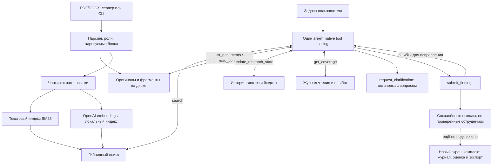

# Основание: архитектурное решение

Состояние на 23 сентября 2026. Agentic RAG подключён на сервере и в CLI. Интерфейс остаётся прежним. Качество выводов оценивается отдельно от работы инструментов.

## Центр системы

Один управляющий агент принимает решения о следующих поисках и чтениях по результатам предыдущих. Гипотеза может изменяться. Индексация, извлечение и сравнение разделов — вспомогательные операции, а не агентность сами по себе.

Слои: документ с исходным файлом/версией/применимостью → адресуемые фрагменты с пунктом, страницей и продолжениями → извлечённые факты с источниками. Названия и нормализованные функции не заменяют точные цитаты.

## Что уже есть

- `packets.py`: чтение нескольких PDF/DOCX, реестр прочитанных/ошибочных/частичных источников, дедупликация по SHA-256, уникальные адреса фрагментов, явные роли по содержимому и ручные уточнения с предупреждениями о противоречии. Автоматические даты и сложные отношения редакций пока не устанавливаются.
- `pdf_input.py`: реальные текстовые PDF, физические страницы, ограничения без тихой обрезки. OCR и подтверждённая геометрическая интерпретация таблиц/колонок отсутствуют.
- `document_store.py`: адресация, чтение пункта с продолжениями/контекстом, соседями и связанными строками таблиц, текст страницы, проверка цитат и охват возвращённых инструментами фрагментов. Поисковый отрывок не засчитывается как прочитанный пункт. Полное чтение означает передачу текста инструментом, не доказательство понимания моделью.
- `/api/packet/read`: серверный вход для комплекта; не вызывает модель и не возвращает выдуманные находки.
- `run_record.py`: сохранение запросов, ответов, параметров, хешей и ошибок без ключей.
- `embeddings.py`, `hybrid_search.py`: реальные эмбеддинги `text-embedding-3-small` (по умолчанию 512 измерений), BM25 + cosine + RRF, атомарный локальный кеш. Фильтры до ранжирования; неизвестные/общие роли сохраняются. Заголовки включаются в поисковое представление, точные цитаты берутся из исходника. Сбой эмбеддингов не подменяется незаметно лексическим поиском.
- `research_state.py`: оригиналы, `packet.json`, `state.json`, история гипотез, свидетельства за/против, пробелы, прочитанные ID и бюджет. Атомарное сохранение без ключей.
- `research_tools.py`: семь реальных инструментов, включая все шесть обязательных и `request_clarification`. Проверка аргументов и доступ только к текущему комплекту.
- `research_agent.py`, `llm.py`: native function calling; следующий инструмент выбирает модель. По умолчанию 24 обращения и 240 секунд. Поздний ответ не выполняется, прерванное действие не выдаётся за успешное, использованный бюджет сохраняется.
- `submit_findings`: проверка чтения, точности цитат, стороны источника и наличия владельца в цитате; ошибки возвращаются агенту. Это не смысловая верификация. Принятые выводы имеют `human_review.status=unreviewed`.
- `POST /api/research/prepare` строит индекс до исследования; `POST /api/research/run` запускает агента; `GET /api/research/<id>` возвращает сохранённое состояние. Подготовка вызывает embeddings, но не управляющую модель.

Основной пользовательский экран ещё использует прежний двух-DOCX сценарий. Новое серверное чтение не объявляется готовой пакетной загрузкой в интерфейсе.

## Схема Подключения

Сплошные связи реализованы в сервере и CLI. Пунктир обозначает отсутствующую интеграцию.

## Следующая Реализация

1. Оценить поиск и выводы отдельно на синтетике и R8/R9. Аннотации и mock не передаются анализатору. Настроенный на них набор является регрессионным, не независимым.
2. Подключить комплект, журнал, источники, решение сотрудника и заключение к рабочему экрану.
3. Автоматические сложные отношения редакций и ответ на уточнение внутри того же исследования пока не реализованы. Для уточнения сейчас нужен новый запуск с исправленными ролями.

## Ограничения доказательств

Три пустых поиска не доказывают потерю функции. Чтение всего предоставленного after не доказывает полноты документов реальной организации. Точная цитата может не подтверждать вывод. Текст страницы не равен визуальной проверке сложной вёрстки. Переименование/сходство названий не доказывает правопреемство. Совмещение обязанностей по тексту не доказывает фактического совершения операций.

Прежний секционный прогон R8/R9 не прошёл приёмку: [вердикт](latest-run-verdict.md). Новые измерения: [отчёт Agentic RAG](agentic-rag-evaluation.md). Технические тесты, живой поиск и смысловая правильность разделены; эталонные ответы не зашиваются в рабочую логику.
